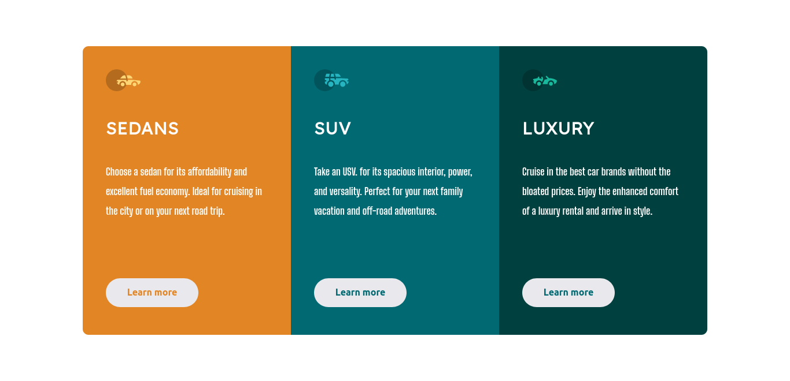

- Site ativo - [Click here to see the website](https://adrianoescarabote.github.io/column-preview-card-component-main/)

# Frontend Mentor - 3-column preview card component solution

Esta é uma solução para o [3-column preview card component challenge on Frontend Mentor](https://www.frontendmentor.io/challenges/3column-preview-card-component-pH92eAR2-). Os desafios do Frontend Mentor ajudam você a melhorar suas habilidades de codificação criando projetos realistas.

## Table of contents

- [Overview](#overview)
  - [The challenge](#the-challenge)
  - [Screenshot](#screenshot)
- [My process](#my-process)
  - [Built with](#built-with)
  - [What I learned](#what-i-learned)
  - [Continued development](#continued-development)
  - [Useful resources](#useful-resources)
- [Author](#author)

## Overview

### The challenge

Os usuários devem ser capazes de:

- Visualizar o layout ideal dependendo do tamanho da tela do dispositivo

### Screenshot

 

## My process

### Built with

- Semantic HTML5 markup
- CSS custom properties
- Flexbox
- CSS Grid
- Mobile-first workflow

### What I learned

Estou bem feliz com o meu desempenho efetuando este projeto e fiquei bem orgulhoso do meu desempenho realizando o projeto, mas, fiquei ainda mais quando fiz a parte de responsividade do layout, que era um assunto um pouco difícil para mim duas semanas atrás e hoje consegui realizar sem muitas dificuldades, mas, quero e preciso melhoras algumas técnicas para melhorar a minha produtividade em projetos responsivos. 
Uma das técnicas que me ajudou bastante foi o mobile first na parte de produtividade e no próprio desempenho do projeto.

### Continued development

Continuo querendo improvisar minhas habilidades com css puro, mas acredito que está na hora de se aventurar com algum framework.

### Useful resources

- [Media query conflitando](https://pt.stackoverflow.com/questions/356923/media-queries-do-css-n%C3%A3o-funciona-e-esta-conflitando) - Sempre que tenho alguma dúvida, gosto de pesquisar na hora para sanar a dúvida, e esse site em especial já me ajudou bastante, acredito que se você é um desenvolvedor igual a mim, já ouviu falar sobre ele, mas se estiver começando, é um bom site para salvar na barra de favoritos porque surge sempre alguma dúvida quando você esta estudando programação.

## Author

- Linkedin - [Adriano Escarabote](https://www.linkedin.com/in/adriano-escarabote-944b02233/)
- Frontend Mentor - [@AdrianoEscarabote](https://www.frontendmentor.io/profile/AdrianoEscarabote)
- Instagram - [@ogdrian](https://www.instagram.com/ogdrian/)
