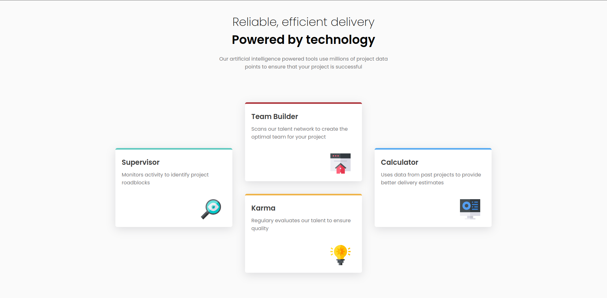
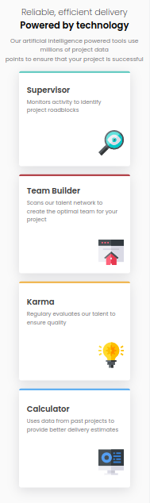

- Site ativo - [Click here to see the Website](https://adrianoescarabote.github.io/four-card-feature-section-master/)

# Frontend Mentor - Four card feature section solution

Esta é uma solução para o [Four card feature section challenge on Frontend Mentor](https://www.frontendmentor.io/challenges/four-card-feature-section-weK1eFYK). Os desafios do Frontend Mentor ajudam você a melhorar suas habilidades de programador criando projetos realistas. 

## Table of contents

- [Overview](#overview)
  - [The challenge](#the-challenge)
  - [Screenshot](#screenshot)
- [My process](#my-process)
  - [Built with](#built-with)
  - [Continued development](#continued-development)
- [Author](#author)

## Overview

### The challenge

Users should be able to:

- Visualize o layout ideal dependendo do tamanho da tela do dispositivo.

### Screenshot

 

## My process

### Built with

- Semantic HTML5 markup
- CSS custom properties
- Flexbox
- CSS Grid
- Mobile-first workflow

### Continued development

Foi bem legal fazer esse challenge, tive alguns desafios interessantes com o grid, e julgo que me sai bem construindo o layout e a responsividade. Estou bem realizado.

## Author

- Linkedin - [@Adriano Escarabote](https://www.linkedin.com/in/adriano-escarabote-944b02233/)
- Frontend Mentor - [@AdrianoEscarabote](https://www.frontendmentor.io/profile/AdrianoEscarabote)
- Instagram - [@ogdrian](https://www.instagram.com/ogdrian/)
