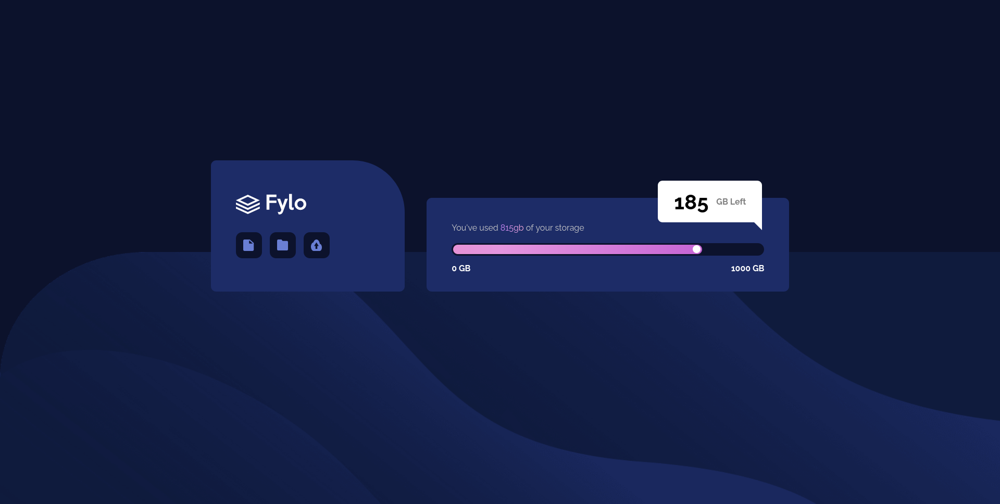
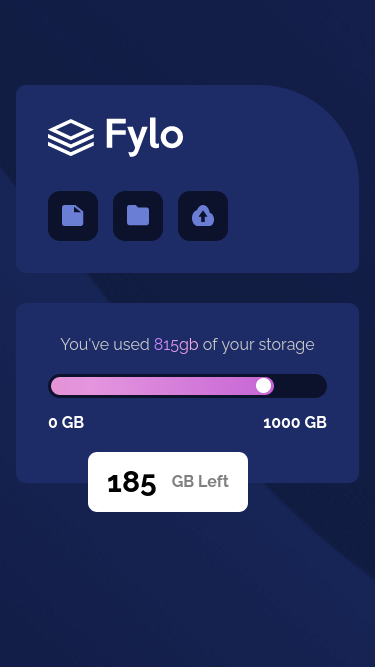

- Active page [Click here to see webpage](https://adrianoescarabote.github.io/fylo-data-storage-component-Animated-download-bar/)

Foi bem divertido realizar este desafio. 
Tive alguns desafios na hora de fazer a responsividade do projeto, mas consegui chegar a um bom resultado.

Adicionei alguns detalhes e algumas animações no layout, esse foi o meu primeiro contato com as animações no css, então está um pouco simples, mas admito que gostei bastante do resultado. 

Sinta-se a vontade para dar um feedback e olhar a resolução.

# Frontend Mentor - Fylo data storage component solution

Esta é uma solução para [Fylo data storage component challenge on Frontend Mentor](https://www.frontendmentor.io/challenges/fylo-data-storage-component-1dZPRbV5n). Os desafios do Frontend Mentor ajudam você a melhorar suas habilidades de codificação criando projetos realistas. 

## Table of contents

- [Overview](#overview)
  - [The challenge](#the-challenge)
- [My process](#my-process)
  - [Built with](#built-with)
- [Author](#author)
- [Screenshot](#screenshot)

## Overview

### The challenge

Users should be able to:

- Visualize o layout ideal para o site, dependendo do tamanho da tela do dispositivo
- Veja os estados de foco para todos os elementos interativos na página

## My process

### Built with

- Semantic HTML5 markup
- CSS custom properties
- Flexbox
- Key frames
- Media queries

## Author

- Linkedin - [AdrianoEscarabote](https://www.linkedin.com/in/adriano-escarabote-944b02233/)
- Frontend Mentor - [@AdrianoEscarabote](https://www.frontendmentor.io/profile/AdrianoEscarabote)
- Instagram - [@ogdrian](https://www.instagram.com/ogdrian/)

### Screenshot

