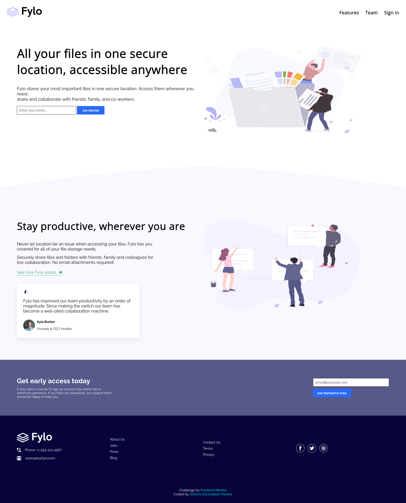
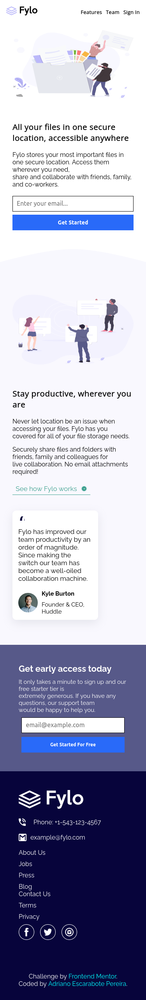

- Live Site URL: [Click here to see the website](https://adrianoescarabote.github.io/fylo-landing-page-with-two-column-layout-master/)

# Frontend Mentor - Fylo landing page with two column layout solution

This is a solution to the [Fylo landing page with two column layout challenge on Frontend Mentor](https://www.frontendmentor.io/challenges/fylo-landing-page-with-two-column-layout-5ca5ef041e82137ec91a50f5). Frontend Mentor challenges help you improve your coding skills by building realistic projects. 

## Table of contents

- [Overview](#overview)
  - [The challenge](#the-challenge)
  - [Screenshot](#screenshot)
- [My process](#my-process)
  - [Built with](#built-with)
- [Author](#author)

## Overview

### The challenge

Users should be able to:

- View the optimal layout for the site depending on their device's screen size
- See hover states for all interactive elements on the page

### Screenshot

## My process

### Built with

- Semantic HTML5 markup
- CSS custom properties
- Flexbox
- CSS Grid
- Mobile-first workflow

## Author

- Linkedin - [AdrianoEscarabote](https://www.linkedin.com/in/adriano-escarabote-944b02233/)
- Frontend Mentor - [@AdrianoEscarabote](https://www.frontendmentor.io/profile/AdrianoEscarabote)
- Instagram - [@ogdrian](https://www.instagram.com/ogdrian/)
