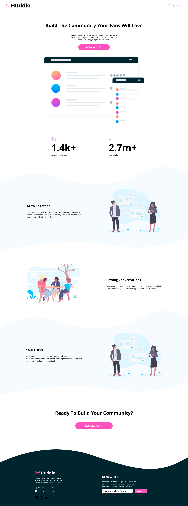

### Links

- Site ativo: [Click here to see the site](https://adrianoescarabote.github.io/huddle-landing-page-with-curved-sections-master/)

# Frontend Mentor - Huddle landing page with curved sections solution

Esta é uma solução para o [Huddle landing page with curved sections challenge on Frontend Mentor](https://www.frontendmentor.io/challenges/huddle-landing-page-with-curved-sections-5ca5ecd01e82137ec91a50f2). Os desafios do Frontend Mentor ajudam você a melhorar suas habilidades de codificação criando projetos realistas.
 

## Table of contents

- [Links](#links)
- [Overview](#overview)
  - [The challenge](#the-challenge)
- [My process](#my-process)
  - [Built with](#built-with)
- [Author](#author)
  - [Screenshot](#screenshot)

## Overview

### The challenge

Users should be able to:

- Visualize o layout ideal para o site, dependendo do tamanho da tela do dispositivo
- Veja os estados de foco para todos os elementos interativos na página

## My process

### Built with

- Semantic HTML5 markup
- CSS custom properties
- Flexbox
- CSS Grid
- Mobile-first workflow

## Author

- Linkedin - [AdrianoEscarabote](https://www.linkedin.com/in/adriano-escarabote-944b02233/)
- Frontend Mentor - [@yourusername](https://www.frontendmentor.io/profile/AdrianoEscarabote)
- Instagram - [@ogdrian](https://www.instagram.com/ogdrian/)

### Screenshot

 
