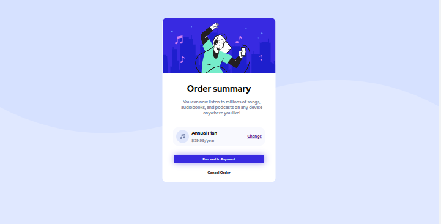
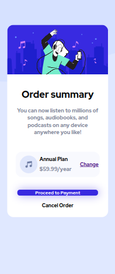

- Clique aqui - [Click hete to see the website](https://order-summary-component-main-mu-peach.vercel.app/)

- Este projeto é o resultado de outro challenge que efetuei do site Front-end Mentor. Este layout é responsivo sido usado apenas html e css para estilizar e deixar o site responsivo, fiquei bem feliz de conseguir terminar este projeto, e sinto que evolui muito, pelo fato de quando fui para a parte de responsividade deste projeto eu tinha um caminho bem mais claro de o que fazer e como fazer para sair um bom resultado.

# Frontend Mentor - Four card feature section solution

Esta é uma solução para o [Four card feature section challenge on Frontend Mentor](https://www.frontendmentor.io/challenges/order-summary-component-QlPmajDUj). Os desafios do Frontend Mentor ajudam você a melhorar suas habilidades de programador criando projetos realistas. 

## Table of contents

- [Overview](#overview)
  - [The challenge](#the-challenge)
  - [Screenshot](#screenshot)
- [My process](#my-process)
  - [Built with](#built-with)
- [Author](#author)

## Overview

### The challenge

Users should be able to:

- Visualize o layout ideal dependendo do tamanho da tela do dispositivo.

### Screenshot

 

## My process

### Built with

- Semantic HTML5 markup
- CSS custom properties
- Flexbox
- Mobile-first workflow

## Author

- Linkedin - [@Adriano Escarabote](https://www.linkedin.com/in/adriano-escarabote-944b02233/)
- Frontend Mentor - [@AdrianoEscarabote](https://www.frontendmentor.io/profile/AdrianoEscarabote)
- Instagram - [@ogdrian](https://www.instagram.com/ogdrian/)
