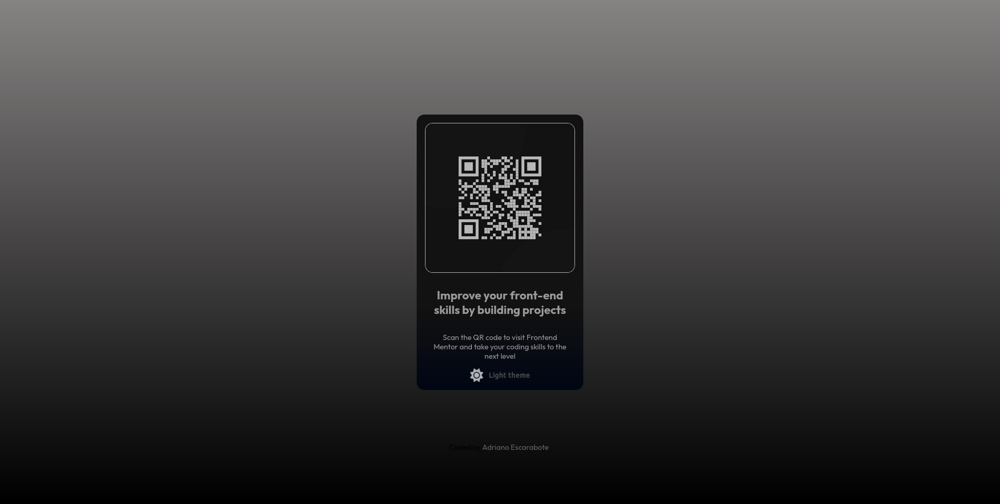
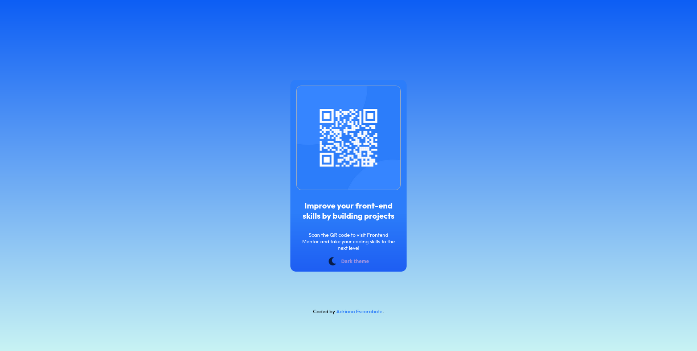
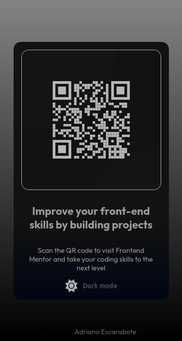

- Active page [Click here to see webpage](https://adrianoescarabote.github.io/qr-code-menu-with-Dark-Light-Theme/)

Foi muito divertido fazer este projeto, esta é a primeira que fiz uma interação com JS, estou realmente muito feliz de ter conseguido fazer sem muitos problemas.

# Frontend Mentor - QR code component solution

Esta é uma solução para [QR code component challenge on Frontend Mentor](https://www.frontendmentor.io/challenges/qr-code-component-iux_sIO_H).
Os desafios do Frontend Mentor ajuda você a melhorar suas habilidades de código criando projetos realistas. 

## Table of contents

- [Overview](#overview)
  - [The challenge](#the-challenge)
- [My process](#my-process)
  - [Built with](#built-with)
- [Author](#author)
- [Screenshot](#screenshot)

## Overview

### The challenge

Users should be able to:

- Visualize o layout ideal para o site, dependendo do tamanho da tela do dispositivo
- Veja os estados de foco para todos os elementos interativos na página
- Altere o tema da pagina através do botão

## My process

### Built with

- Semantic HTML5 markup
- CSS custom properties
- Flexbox
- Media queries

## Author

- Linkedin - [AdrianoEscarabote](https://www.linkedin.com/in/adriano-escarabote-944b02233/)
- Frontend Mentor - [@AdrianoEscarabote](https://www.frontendmentor.io/profile/AdrianoEscarabote)
- Instagram - [@ogdrian](https://www.instagram.com/ogdrian/)

### Screenshot

