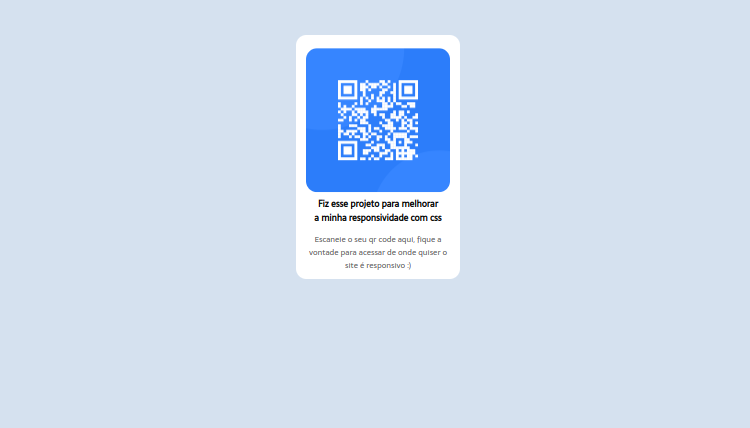
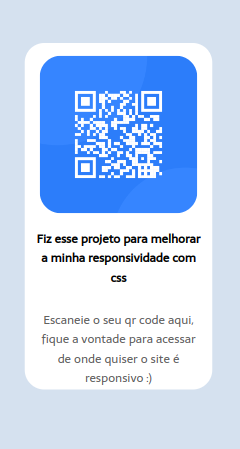

# Frontend Mentor - QR code component solution

Esta é uma solução para o [QR code component challenge on Frontend Mentor](https://www.frontendmentor.io/challenges/qr-code-component-iux_sIO_H). Os desafios do Frontend Mentor ajudam você a melhorar suas habilidades de codificação criando projetos realistas.

## Table of contents

- [Overview](#overview)
  - [Screenshot](#screenshot)
- [My process](#my-process)
  - [Built with](#built-with)
  - [Continued development](#continued-development)
- [Author](#author)

## Overview

### Screenshot

## My process

### Built with

- Semantic HTML5 markup
- CSS custom properties
- Flexbox
- Mobile-first workflow

### Continued development

Este foi a minha primeira vez fazendo um projeto do site Frontend Mentor. Lembro de ter ficado muito feliz com o meu desempenho. O site é totalmente responsivo, sido criado apenas com HTML e CSS puro, usando apenas flexbox para criar a responsividade do layout.

## Author

- Linkedin - [Adriano Escarabote](https://www.linkedin.com/in/adriano-escarabote-944b02233/)
- Frontend Mentor - [@AdrianoEscarabote](https://www.frontendmentor.io/profile/AdrianoEscarabote)
- Instagram - [@ogdrian](https://www.instagram.com/ogdrian/)
