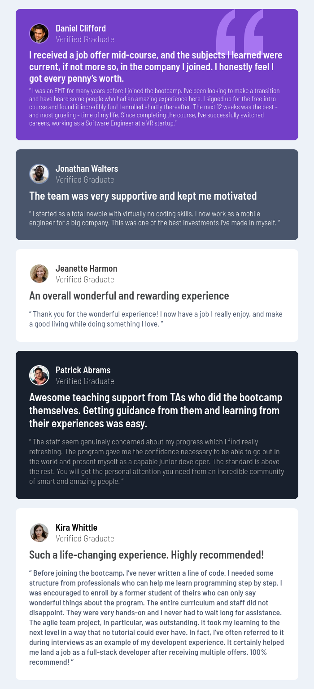

- Site ativo - [Click here to see the website](https://adrianoescarabote.github.io/testimonials-grid-section-main/)

- Estou bem feliz sinto que dominei bastante a responsividade no css, é ótimo sentir a sua evolução. Estou cada vez mais feliz estudando desenvolvimento web, claro que, tive alguns desafios quando comecei a programar, mas me sinto realizado que superei todos os meus desafios do começo. Efetuar um layout com grid que é uma estrutura de definição de layout que eu tinha dificuldade no começo, é motivo para comemoração. Sim!

# Frontend Mentor - Testimonials grid section solution

Esta é uma solução para o [Testimonials grid section challenge on Frontend Mentor](https://www.frontendmentor.io/challenges/testimonials-grid-section-Nnw6J7Un7). Os desafios do Frontend Mentor ajudam você a melhorar suas habilidades de codificação criando projetos realistas.

## Table of contents

- [Overview](#overview)
  - [The challenge](#the-challenge)
  - [Built with](#built-with)
- [Author](#author)
  - [Screenshot](#screenshot)
- [My process](#my-process)

## Overview

## My process

### Built with

- Semantic HTML5 markup
- CSS custom properties
- Flexbox
- CSS Grid
- Mobile-first workflow

## Author

- Linkedin - [Adriano Escarabote](https://www.linkedin.com/in/adriano-escarabote-944b02233/)
- Frontend Mentor - [@AdrianoEscarabote](https://www.frontendmentor.io/profile/AdrianoEscarabote)
- Instagram - [@ogdrian](https://www.instagram.com/ogdrian/)

### The challenge

Users should be able to:

- Visualize o layout ideal para o site, dependendo do tamanho da tela do dispositivo.

### Screenshot

