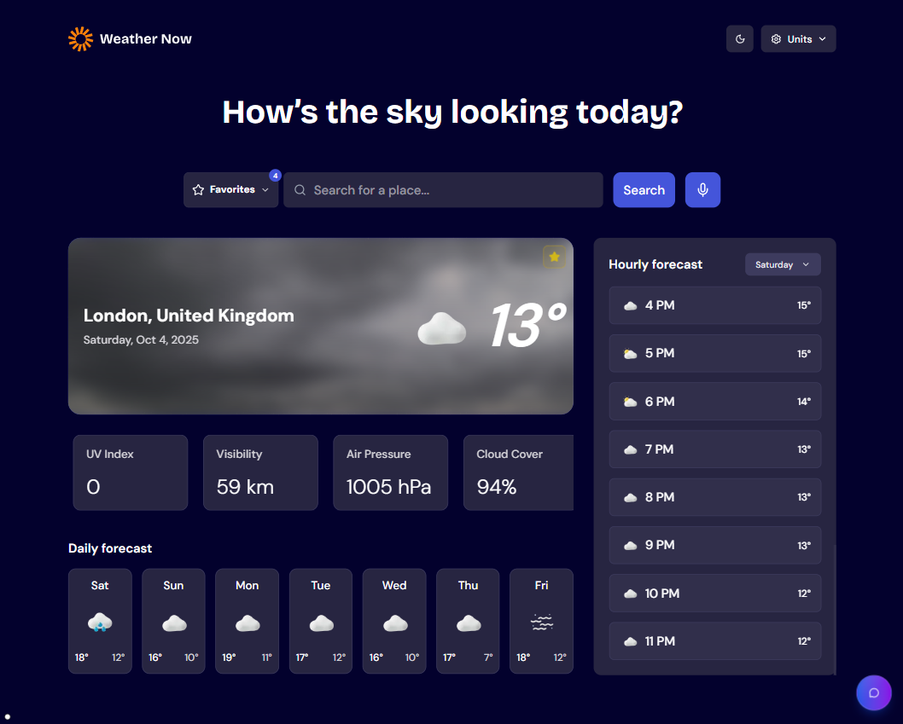

# Weather App Solution

This is a solution to the [Weather app challenge on Frontend Mentor](https://www.frontendmentor.io/challenges/weather-app-K1FhddVm49). Frontend Mentor challenges help you improve your coding skills by building realistic projects.



## 📋 Contents

- [The challenge](#the-challenge)
- [Features](#features)
- [My process](#my-process)
- [Setup](#setup)
- [Technologies Used](#technologies-used)
- [Architecture](#architecture)
- [Environment](#environment)
- [Scripts](#scripts)
- [Testing](#testing)
- [Accessibility](#accessibility)
- [PWA](#pwa)
- [Performance (Lighthouse)](#performance-lighthouse)
- [Author](#author)
- [License](#license)

## The Challenge

Users should be able to:

- Search for weather information by entering a location in the search bar
- View current weather conditions including temperature, weather icon, and location details
- See additional weather metrics like "feels like" temperature, humidity percentage, wind speed, and precipitation amounts
- Browse a 7-day weather forecast with daily high/low temperatures and weather icons
- View an hourly forecast showing temperature changes throughout the day
- Switch between different days of the week using the day selector in the hourly forecast section
- Toggle between Imperial and Metric measurement units via the units dropdown
- Switch between specific temperature units (Celsius and Fahrenheit) and measurement units for wind speed (km/h and mph) and precipitation (millimeters) via the units dropdown
- View the optimal layout for the interface depending on their device's screen size
- See hover and focus states for all interactive elements on the page

## Features

- Voice search button (Web Speech API)
  - Component: [app/\_components/voice-search-button/index.tsx](app/_components/voice-search-button/index.tsx)
  - Uses `SpeechRecognition`/`webkitSpeechRecognition` with timeout, friendly errors, and animations.
- AI chat assistant about weather
  - UI: [app/\_components/floating-chat-button/index.tsx](app/_components/floating-chat-button/index.tsx)
  - API: [app/api/chat/route.ts](app/api/chat/route.ts) (GROQ). Maintains context for city/units and next 24h.
- Skeleton loaders
  - [app/\_components/weather-summary/weather-summary-skeleton.tsx](app/_components/weather-summary/weather-summary-skeleton.tsx)
  - [app/\_components/hourly-forecast/hourly-forecast-skeleton.tsx](app/_components/hourly-forecast/hourly-forecast-skeleton.tsx)
- PWA ready
  - Manifest: [public/manifest.json](public/manifest.json)
  - Icon: [public/favicon.ico](public/favicon.ico)
- Animated weather backgrounds
  - Videos mapped by weathercode: [app/\_components/weather-summary/index.tsx](app/_components/weather-summary/index.tsx)
  - Assets: [public/images](public/images)
- Extra metrics: UV index, visibility, air pressure
  - Cards: [app/\_components/weather-summary/index.tsx](app/_components/weather-summary/index.tsx)
- Dark/Light theme
  - Provider: [app/\_components/theme-provider/index.tsx](app/_components/theme-provider/index.tsx)
- Geolocation on first visit
  - Bootstrapping: [app/page.tsx](app/page.tsx)
- Share image (Open Graph)
  - Endpoint: [app/api/og/route.tsx](app/api/og/route.tsx)

## My process

- Zustand for global store: [app/\_store/weather.ts](app/_store/weather.ts)
- Open‑Meteo as data source. AI chat via GROQ.

## Setup

1. Clone and install

```sh
git clone https://github.com/AdrianoEscarabote/weather-app
cd weather-app
npm install
```

2. Environment variables (.env.local)

```ini
# For AI chat
GROQ_API_KEY=your_key_here
```

3. Dev

```sh
npm run dev
```

## 🧰 Technologies Used

- OS: Windows
- Front-end: Next.js, TypeScript, Tailwind CSS, Zustand, Jest, React Hook Form, ESLint, Playwright
- Extras: Radix UI, framer-motion, Embla Carousel, next-themes, next-pwa

## Architecture

- Pages and components: [app/](app/)
- State/global: [app/\_store/weather.ts](app/_store/weather.ts)
- API routes:
  - Chat: [app/api/chat/route.ts](app/api/chat/route.ts)
  - Open Graph: [app/api/og/route.tsx](app/api/og/route.tsx)
- Main UI:
  - Summary: [app/\_components/weather-summary](app/_components/weather-summary)
  - Daily: [app/\_components/daily-forecast](app/_components/daily-forecast)
  - Hourly: [app/\_components/hourly-forecast](app/_components/hourly-forecast)
  - Search: [app/\_components/search-form](app/_components/search-form), [app/\_components/search-dropdown](app/_components/search-dropdown)
  - Voice Search: [app/\_components/voice-search-button](app/_components/voice-search-button)
  - Chat: [app/\_components/floating-chat-button](app/_components/floating-chat-button)
  - Alerts: [app/\_components/weather-alert](app/_components/weather-alert), [app/\_components/rain-alert](app/_components/rain-alert)

## Environment

- Geolocation permission is requested on first access ([app/page.tsx](app/page.tsx)); fallback to London.
- Voice Search depends on browser support (Chrome/Android). There are error messages and a 10s timeout.

## Scripts

```sh
npm run dev        # dev server (Turbopack)
npm run build      # build
npm run start      # local production
npm run lint       # eslint
npm run test       # unit tests (Jest)
npm run e2e        # headless E2E (Playwright)
npm run e2e:ui     # Playwright UI
```

## Testing

- Unit tests (Jest)
  - Examples:
    - Weather Summary: [app/\_components/weather-summary/weather-summary.test.tsx](app/_components/weather-summary/weather-summary.test.tsx)
    - Hourly Forecast: [app/\_components/hourly-forecast/hourly-forecast.test.tsx](app/_components/hourly-forecast/hourly-forecast.test.tsx)
    - Daily Forecast: [app/\_components/daily-forecast/daily-forecast.test.tsx](app/_components/daily-forecast/daily-forecast.test.tsx)
    - Favorites Menu: [app/\_components/favorites-menu/favorites-menu.test.tsx](app/_components/favorites-menu/favorites-menu.test.tsx)
    - Search Dropdown: [app/\_components/search-dropdown/search-dropdown.test.tsx](app/_components/search-dropdown/search-dropdown.test.tsx)
    - Boot Preloader: [app/\_components/boot-preloader/boot-preloader.test.tsx](app/_components/boot-preloader/boot-preloader.test.tsx)
    - Mode/Theme Toggle: [app/\_components/mode-toggle/mode-toggle.test.tsx](app/_components/mode-toggle/mode-toggle.test.tsx)
    - Rain/Weather Alert: [app/\_components/rain-alert/rain-alert.test.tsx](app/_components/rain-alert/rain-alert.test.tsx), [app/\_components/weather-alert/weather-alert.test.tsx](app/_components/weather-alert/weather-alert.test.tsx)
    - Floating Chat: [app/\_components/floating-chat-button/floating-chat-buttont.test.tsx](app/_components/floating-chat-button/floating-chat-buttont.test.tsx)
  - Common polyfills in JSDOM: `scrollTo`, `scrollIntoView`, `requestAnimationFrame`.

- E2E (Playwright)
  - Commands:
    - Headed UI: `npm run e2e:ui`
    - Headless: `npm run e2e`
    - Tip: for full determinism locally/CI, run with a single worker: `npx playwright test --workers=1`
  - Specs:
    - Basic smoke: [e2e/basic.spec.ts](e2e/basic.spec.ts)
    - Bootstrap/fallback: [e2e/bootstrap.spec.ts](e2e/bootstrap.spec.ts)
    - Favorites flow: [e2e/favorites.spec.ts](e2e/favorites.spec.ts)
    - Search suggestions: [e2e/search-suggestions.spec.ts](e2e/search-suggestions.spec.ts)
    - Units + Theme: [e2e/units-and-theme.spec.ts](e2e/units-and-theme.spec.ts)
    - Persistence (reload): [e2e/persistence.spec.ts](e2e/persistence.spec.ts)
    - Voice search (SpeechRecognition mock): [e2e/voice-search.spec.ts](e2e/voice-search.spec.ts)
    - Open Graph image: [e2e/og.spec.ts](e2e/og.spec.ts)
  - Mocks/boot helpers:
    - Fixtures: [e2e/fixtures/weather.json](e2e/fixtures/weather.json)
    - Utils: [e2e/utils/mocks.ts](e2e/utils/mocks.ts)
      - `bootstrapApp(page, { city, country })`: standardizes app bootstrap (mocks, fallback, and waits for a stable UI)
      - `mockForecast`, `mockReverseGeocode`, `mockGeocodingSuggestions`
      - `clearClientState`, `dismissRainAlertIfPresent`, `stubBrowserNotifications`
  - Debug:
    - Console and exceptions: `page.on('console'...)`, `page.on('pageerror'...)`
    - HTML report: after running, open the generated Playwright report (playwright-report)
    - Traces/Video (optional in playwright.config): `trace: 'on-first-retry'`, `video: 'on'`

## Accessibility

- Carousel with keyboard navigation and roledescription (slides): [app/\_components/weather-summary/index.tsx](app/_components/weather-summary/index.tsx)
- Labels/aria in header, metrics, and chat.
- Visible focus on controls.

## PWA

- Manifest at [public/manifest.json](public/manifest.json).
- To test as PWA: build and start production.

```sh
npm run build && npm run start
# access http://localhost:3000 and "Install app" in your browser
```

## Performance (Lighthouse)

- Results:

Desktop


Mobile


## 👤 Author

**AdrianoEscarabote**

- Github: [@AdrianoEscarabote](https://github.com/AdrianoEscarabote)
- Linkedin: [@AdrianoEscarabote](https://www.linkedin.com/in/AdrianoEscarabote/)
- Frontend Mentor: [@AdrianoEscarabote](https://www.frontendmentor.io/profile/AdrianoEscarabote)
- Twitter: [@drianEscarabote](https://twitter.com/drianEscarabote)

## 📝 License

Copyright © 2025 [AdrianoEscarabote](https://github.com/AdrianoEscarabote).<br />
This project is [MIT](https://github.com/AdrianoEscarabote/weather-app/blob/main/LICENSE) licensed.

---

## Show your support

Give a ⭐️ if this project helped you!
